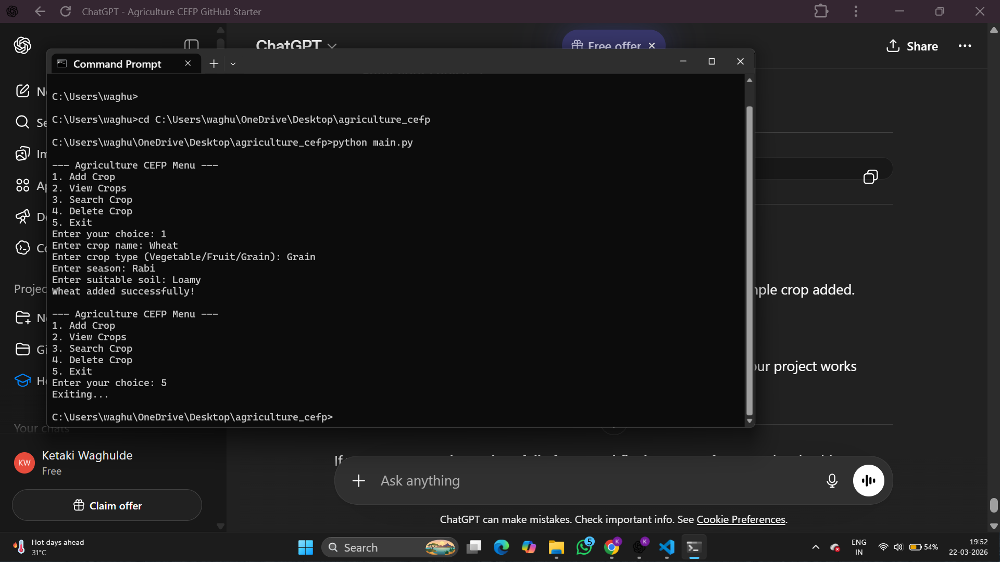
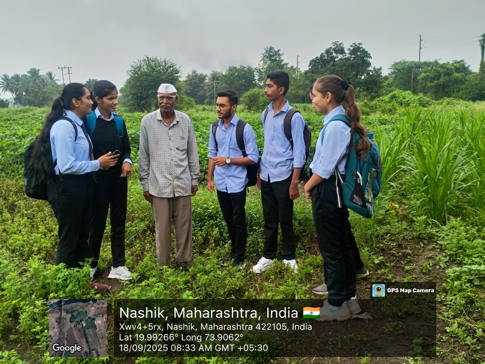

# Agriculture CEFP - Crop & Farm Management System

A simple **Python CLI project** to manage crops for agriculture students. Users can add, view, search, and delete crop details with persistent storage in JSON.

---

## Features
- Add crop details: name, type (Vegetable/Fruit/Grain), season, soil
- View all crops
- Search crops by name
- Delete crops
- Data stored persistently in `crops.json`

---

## Technologies
- Python 3.x
- JSON for data storage
- Command-Line Interface (CLI)

---

## How to Run
1. Clone the repository:

```bash
git clone https://github.com/yourusername/agriculture_cefp.git
## Screenshot

Here’s how the Agriculture CEFP program looks when running:


## Team Photo

Here’s our team behind the Agriculture CEFP project:

